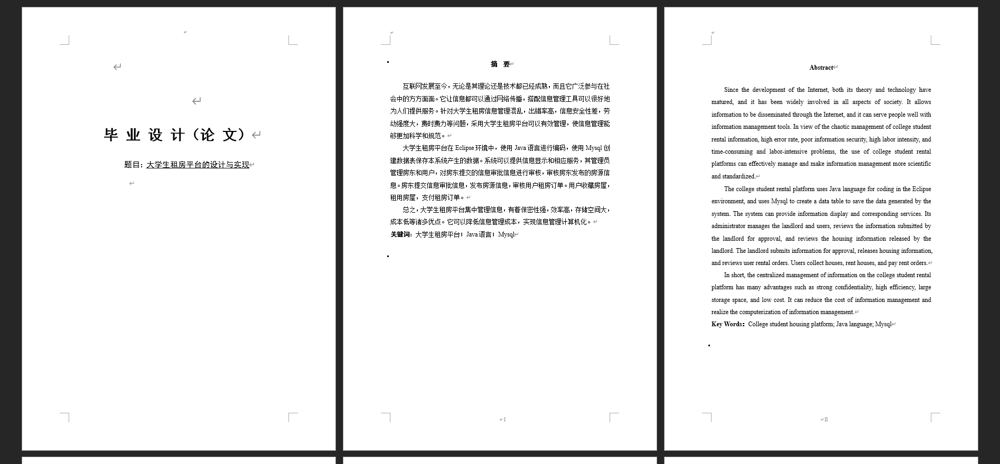
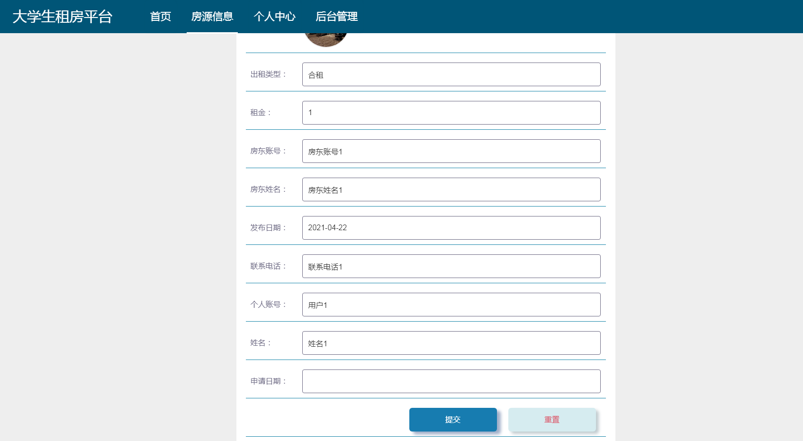
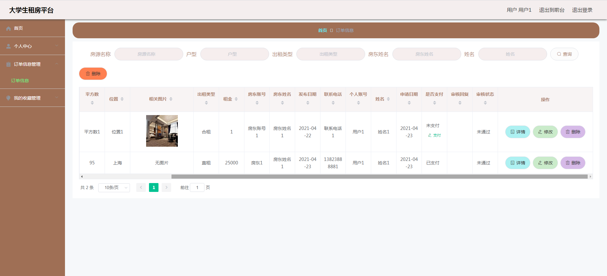
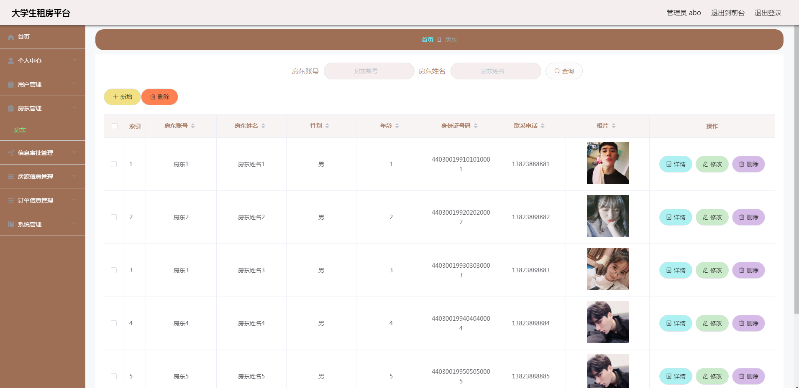
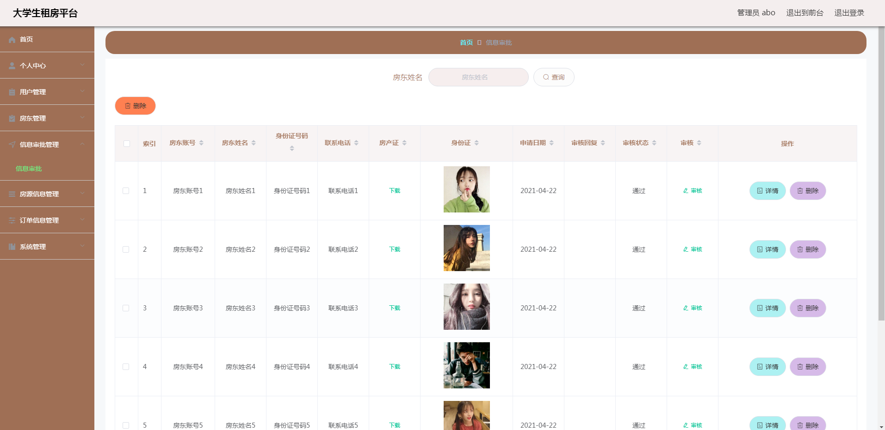
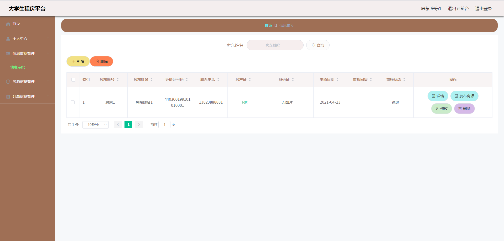
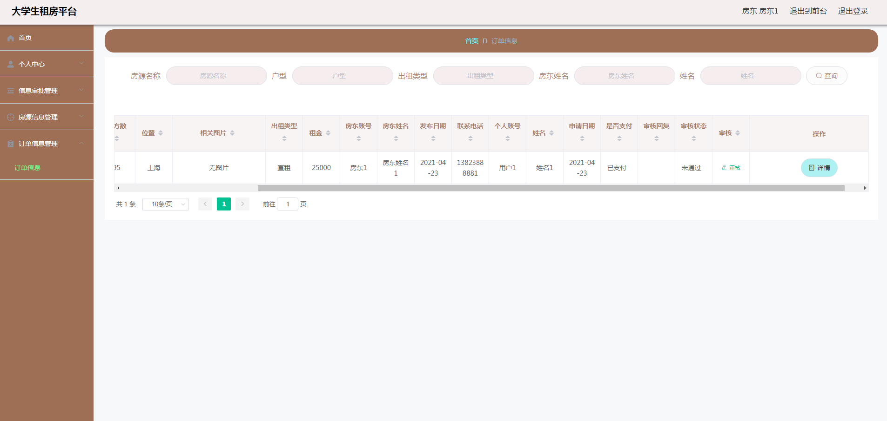

基于SpringBoot的大学生租房平台（程序+论文）
=
- 完整代码获取地址：从戎源码网 ([https://armycodes.com/](https://armycodes.com/))
- 作者微信：19941326836  QQ：952045282 
- 承接计算机毕业设计、Java毕业设计、Python毕业设计、深度学习、机器学习
- 选题+开题报告+任务书+程序定制+安装调试+论文+答辩ppt 一条龙服务
- 所有选题地址https://github.com/nature924/allProject

一、项目介绍
---
系统包含两种角色：用户、管理员，系统分为前台和后台两大模块，主要功能如下：
### 1 管理员功能实现
房东管理: 管理员管理房东的资料，包括修改、新增、删除等操作。
信息审批管理: 管理员审批房东上传的房产证和身份证信息，审批通过后房东才能发布房源信息。
房源信息管理: 管理员审核房东发布的房源信息，审核通过后房源信息才能展示在前台进行出租。

### 2 房东功能实现
信息审批管理: 房东查看信息审批状态，通过审核后才能发布房源信息。
房源信息管理: 房东管理发布的房源信息，发布前需要管理员审核。
订单信息管理: 房东查看并审核用户的租房订单，确认用户是否支付。

### 3 用户功能实现
房源信息: 用户查看所有要出租的房源信息，可以根据房源名称、户型、出租类型等字段查询。
房源详细信息: 用户查看房源的详细介绍，可以收藏房源或点击租房按钮进行租房。
提交租房信息: 用户提交租房申请，设置申请日期。
订单信息管理: 用户查看并支付租房订单，确认订单是否通过房东审核。

二、项目技术
---
- 编程语言：Java
- 数据库：MySQL
- 项目管理工具：Maven
- 前端技术：VUE、HTML、Jquery、Bootstrap
- 后端技术：Spring、SpringMVC、MyBatis

三、运行环境
---
- 操作系统：Windows、macOS都可以
- JDK版本：JDK1.8以上都可以
- 开发工具：IDEA、Ecplise、Myecplise都可以
- 数据库: MySQL5.7以上都可以
- Tomcat：任意版本都可以
- Maven：任意版本都可以

四、运行截图
---
### 论文截图：

### 程序截图：

